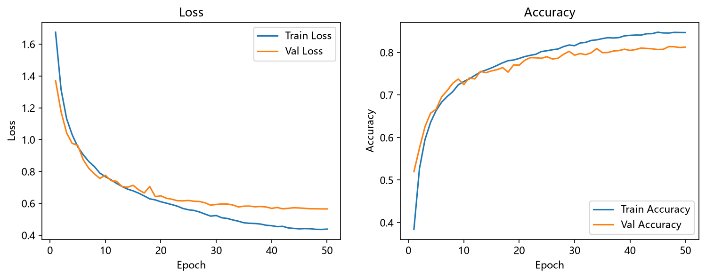
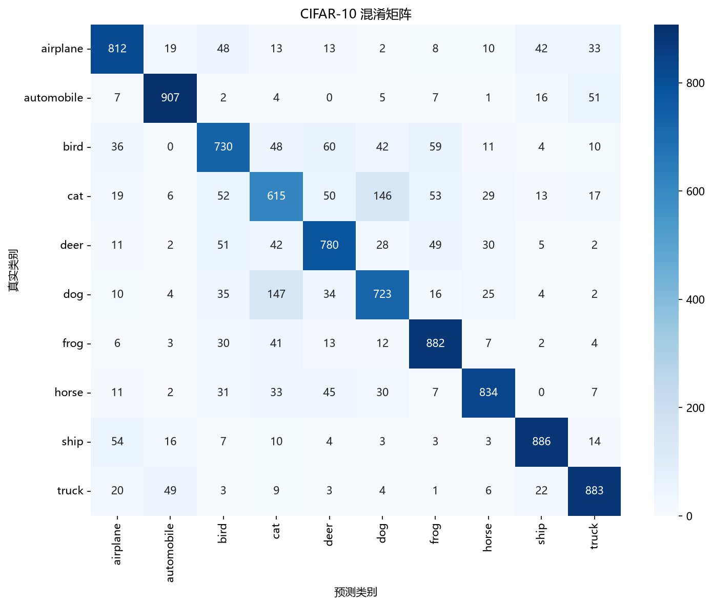

# CIFAR-10 图像分类

这是一个基于 PyTorch 实现的 CIFAR-10 图像分类项目，包含数据预处理、模型训练、验证集选优、测试集评估、结果可视化以及外部图片预测等完整流程。

## 项目功能

- 自动下载并加载 CIFAR-10 数据集
- 将训练集划分为 45,000 张训练图片和 5,000 张验证图片
- 使用随机裁剪、随机水平翻转等方式增强训练数据
- 使用三层卷积神经网络完成 10 类图像分类
- 自动使用 CUDA GPU；无可用 GPU 时回退到 CPU
- 根据验证集准确率保存最佳模型
- 通过 TensorBoard 记录训练指标
- 输出训练曲线、混淆矩阵、正确样本和错误样本
- 支持预测单张图片、多张图片或整个图片目录

## 数据类别

CIFAR-10 共包含以下 10 个类别：

| 英文类别 | 中文含义 |
| --- | --- |
| airplane | 飞机 |
| automobile | 汽车 |
| bird | 鸟 |
| cat | 猫 |
| deer | 鹿 |
| dog | 狗 |
| frog | 青蛙 |
| horse | 马 |
| ship | 船 |
| truck | 卡车 |

## 项目结构

```text
分类数据集/
├── data/                  CIFAR-10 数据集
├── checkpoints/           训练得到的最佳模型
│   └── best_model.pth
├── logs/                  TensorBoard 日志
├── outputs/               训练和测试生成的图表
├── predict_picture/       默认待预测图片目录
├── dataset.py             数据预处理、划分和 DataLoader
├── model.py               CNN 模型定义
├── train.py               模型训练与验证
├── test.py                测试、指标计算和结果可视化
├── predict.py             外部图片预测
├── quick_test_train.py    数据和训练流程快速自检
├── utils.py               随机种子等工具函数
└── requirements.txt       Python 依赖
```

## 环境要求

- Python 3.13
- PyTorch 2.11.0
- torchvision 0.26.0
- NumPy、Pillow、Matplotlib、Seaborn、scikit-learn、TensorBoard

建议先创建虚拟环境：

```powershell
python -m venv .venv
.\.venv\Scripts\Activate.ps1
python -m pip install --upgrade pip
```

安装项目依赖：

```powershell
pip install -r requirements.txt
```

如需使用 NVIDIA GPU，可先按照本机 CUDA 环境安装对应版本的 PyTorch。例如 CUDA 12.8：

```powershell
pip install torch torchvision --index-url https://download.pytorch.org/whl/cu128
pip install -r requirements.txt
```

可以通过以下命令检查 PyTorch 是否识别到 GPU：

```powershell
python -c "import torch; print(torch.cuda.is_available()); print(torch.cuda.get_device_name(0) if torch.cuda.is_available() else 'CPU')"
```

## 数据路径配置

当前 `dataset.py` 中的数据目录固定为：

```text
C:\PythonProject\分类数据集\data
```

如果项目移动到了其他位置，请将 `dataset.py` 第 23、26、29 行的 `root` 修改为实际的数据目录。第一次运行时，`torchvision` 会在该目录中自动下载 CIFAR-10；当前仓库已经包含数据文件时则会直接读取。

## 快速自检

正式训练前，可以先运行快速测试。它只训练几个 batch，用于检查数据加载、模型前向传播、反向传播以及模型保存和加载是否正常：

```powershell
python quick_test_train.py
```

## 训练模型

运行：

```powershell
python train.py
```

默认训练参数：

| 参数 | 默认值 |
| --- | ---: |
| Batch size | 128 |
| Epochs | 50 |
| 初始学习率 | 0.001 |
| 权重衰减 | 0.0005 |
| 优化器 | AdamW |
| 损失函数 | CrossEntropyLoss |
| 学习率调度 | CosineAnnealingLR |

训练过程中会完成以下操作：

1. 每轮输出训练损失、训练准确率、验证损失和验证准确率。
2. 将验证准确率最高的模型保存到 `checkpoints/best_model.pth`。
3. 将 TensorBoard 日志写入 `logs/`。
4. 将损失和准确率曲线保存到 `outputs/training_curves.png`。

查看 TensorBoard：

```powershell
tensorboard --logdir logs
```

然后在浏览器中打开终端显示的地址，通常为 `http://localhost:6006`。

## 测试与评估

确保 `checkpoints/best_model.pth` 存在，然后运行：

```powershell
python test.py
```

测试脚本会输出：

- 总体测试准确率
- 每个类别的 Precision、Recall 和 F1-score
- 最常见的错误分类组合

同时会在 `outputs/` 中生成：

- `confusion_matrix.png`：混淆矩阵
- `correct_samples.png`：随机抽取的正确预测样本
- `wrong_samples.png`：随机抽取的错误预测样本

> `test.py` 最后会调用 `plt.show()` 显示图表。在无桌面环境中运行时，可以使用 Matplotlib 的非交互式后端。

## 图片预测

直接运行时，程序会预测 `predict_picture/` 目录内的所有支持图片：

```powershell
python predict.py
```

预测单张图片：

```powershell
python predict.py predict_picture\airplane.png
```

预测多张图片：

```powershell
python predict.py image1.jpg image2.png
```

预测整个目录及其子目录中的图片：

```powershell
python predict.py path\to\images
```

支持 `.jpg`、`.jpeg`、`.png`、`.bmp`、`.webp` 和 `.gif` 格式。程序会将图片转换为 RGB、缩放到 `32 x 32`，并输出概率最高的 5 个类别。

## 模型结构

当前模型由三组卷积和池化层以及两层全连接层组成：

```text
输入 [3, 32, 32]
  -> Conv(3, 32, 5x5) + ReLU + MaxPool
  -> Conv(32, 32, 5x5) + ReLU + MaxPool
  -> Conv(32, 64, 5x5) + ReLU + MaxPool
  -> Flatten
  -> Linear(1024, 64) + ReLU
  -> Linear(64, 10)
```

模型最后输出 10 个 logits。训练时由 `CrossEntropyLoss` 直接计算损失，预测时再通过 Softmax 转换为类别概率。

## 已生成结果

仓库当前包含以下训练和评估产物：





## 注意事项

- 外部图片与 CIFAR-10 的低分辨率训练图片可能存在较大的数据分布差异，因此实际图片的预测效果可能低于测试集表现。
- 修改模型结构后，需要重新训练模型；旧的 `best_model.pth` 可能无法加载到新模型中。
- 如需调整训练轮数、学习率等参数，可修改 `train.py` 中 `main()` 函数开头的配置。
- 为保证实验可复现，数据划分和训练随机种子均设置为 `42`。

## 后续优化方向

- 使用 BatchNorm、Dropout 或标签平滑提高泛化能力
- 将基础 CNN 替换为适配 CIFAR-10 的 ResNet18
- 尝试 Mixup、CutMix、RandomErasing 等增强方法
- 加入混合精度训练以提升 GPU 训练速度
- 将数据路径和训练参数整理为命令行参数或独立配置文件
