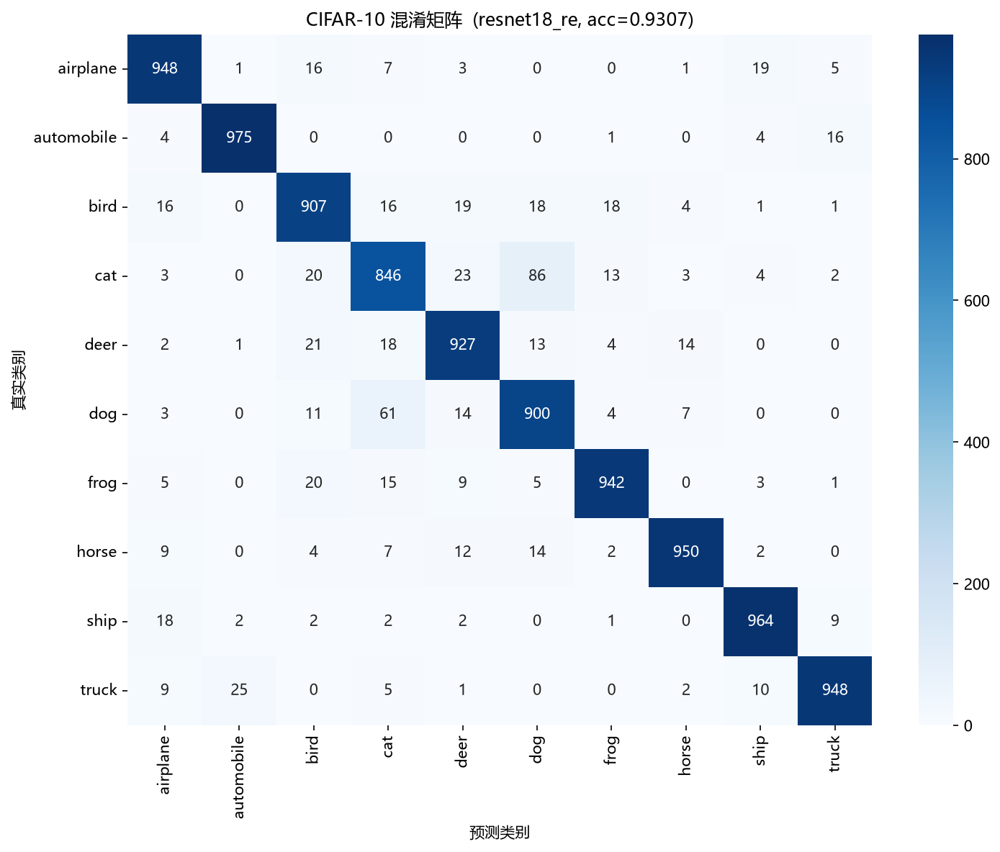
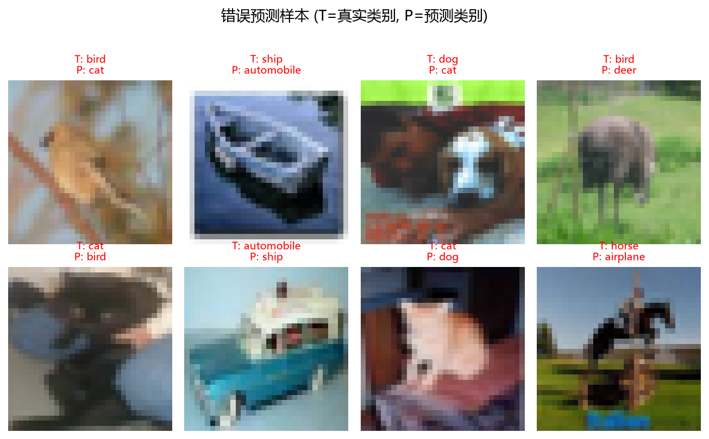

# CIFAR-10 图像分类

基于 PyTorch 实现的 CIFAR-10 图像分类项目，包含数据下载与预处理、模型训练、验证集选优、测试集评估、结果可视化以及外部图片预测的完整流程。

**当前最佳成绩：测试集准确率 93.07%**（适配 CIFAR-10 的 ResNet18）

## 项目功能

- 自动下载并加载 CIFAR-10 数据集
- 将 50,000 张训练图划分为 45,000 张训练集和 5,000 张验证集
- 数据增强：随机裁剪、随机水平翻转、随机擦除（RandomErasing）
- 归一化：按 CIFAR-10 的逐通道均值和标准差标准化
- 模型：适配 32×32 输入的 ResNet18（BatchNorm 由网络自带）
- 泛化手段：Dropout、标签平滑（Label Smoothing）
- 训练加速：bf16 混合精度（AMP）、多进程数据加载
- 自动使用 CUDA GPU；无可用 GPU 时回退到 CPU
- 按验证集准确率保存最佳模型，并把训练配置一并存入存档
- TensorBoard 记录训练/验证的损失和准确率
- 输出训练曲线、混淆矩阵、正确样本和错误样本
- 支持预测单张图片、多张图片或整个图片目录
- **所有路径和超参数集中在 `config.py`，并支持命令行覆盖**

## 快速开始

### 1. 安装依赖

```powershell
python -m venv .venv
.\.venv\Scripts\Activate.ps1
python -m pip install --upgrade pip
pip install -r requirements.txt
```

如需 GPU 训练，先按本机 CUDA 版本安装 PyTorch（例如 CUDA 12.8）：

```powershell
pip install torch torchvision --index-url https://download.pytorch.org/whl/cu128
pip install -r requirements.txt
```

检查 GPU 是否可用：

```powershell
python -c "import torch; print(torch.cuda.is_available())"
```

### 2. 训练

```powershell
python train.py
```

第一次运行会自动下载 CIFAR-10（约 170 MB）。

### 3. 评估

```powershell
python test.py
```

### 4. 预测

```powershell
python predict.py 你的图片.jpg
```

## 配置说明

### 所有参数集中在 `config.py`

路径、数据参数、模型参数、训练超参数都在 `config.py` 的 `Config` 类里，改一处全局生效：

```python
@dataclass
class Config:
    # 路径
    data_root: Path = BASE_DIR / "data"
    ckpt_dir:  Path = BASE_DIR / "checkpoints"
    log_dir:   Path = BASE_DIR / "logs"
    out_dir:   Path = BASE_DIR / "outputs"

    # 数据
    batch_size:  int = 128
    num_workers: int = 2
    val_size:    int = 5000
    split_seed:  int = 42

    # 数据增强
    crop_padding: int   = 4
    erase_p:      float = 0.25   # 改成 0.0 即关闭 RandomErasing

    # 模型
    num_classes: int   = 10
    dropout:     float = 0.3

    # 训练
    exp_name:        str   = "resnet18_re_100ep"
    epochs:          int   = 100
    lr:              float = 1e-3
    weight_decay:    float = 5e-4
    label_smoothing: float = 0.1
    seed:            int   = 42
    use_amp:         bool  = True
```

### 命令行覆盖

**优先级：命令行参数 > `config.py` 默认值**

```powershell
python train.py --help                       # 查看全部参数
python train.py --exp exp_c --epochs 50      # 只覆盖这两项，其余用默认值
python train.py --lr 3e-4 --no-amp           # 换学习率、关掉混合精度
python train.py --erase-p 0.0 --num-workers 0
```

可用的命令行参数：

| 参数 | 说明 |
| --- | --- |
| `--exp` | 实验名，决定存档和日志的文件名 |
| `--epochs` | 训练轮数 |
| `--lr` | 学习率 |
| `--weight-decay` | 权重衰减 |
| `--batch-size` | 批大小 |
| `--num-workers` | DataLoader 子进程数 |
| `--dropout` | 分类头 Dropout 概率 |
| `--label-smoothing` | 标签平滑系数 |
| `--erase-p` | RandomErasing 概率，0 表示关闭 |
| `--seed` | 随机种子 |
| `--data-root` | CIFAR-10 数据目录 |
| `--no-amp` | 关闭混合精度 |

**实验名的作用**：`--exp` 决定三个输出路径，换实验名就不会互相覆盖。

```text
checkpoints/{exp_name}.pth          模型权重
logs/{exp_name}/                    TensorBoard 日志
outputs/curves_{exp_name}.png       训练曲线
```

## 项目结构

```text
分类数据集/
├── config.py              所有路径和超参数（唯一来源）
├── dataset.py             数据下载、预处理、划分、DataLoader
├── model.py               模型定义（ResNet18 和基线 SmallCNN）
├── train.py               训练与验证
├── test.py                测试集评估与结果可视化
├── predict.py             外部图片预测
├── utils.py               随机种子等工具
├── requirements.txt       Python 依赖
├── think.txt              项目规划
├── data/                  CIFAR-10 数据
├── checkpoints/           模型权重
├── logs/                  TensorBoard 日志
├── outputs/               训练曲线、混淆矩阵、样本图
└── predict_picture/       默认待预测图片目录
```

## 数据类别

| 索引 | 英文 | 中文 |
| ---: | --- | --- |
| 0 | airplane | 飞机 |
| 1 | automobile | 汽车 |
| 2 | bird | 鸟 |
| 3 | cat | 猫 |
| 4 | deer | 鹿 |
| 5 | dog | 狗 |
| 6 | frog | 青蛙 |
| 7 | horse | 马 |
| 8 | ship | 船 |
| 9 | truck | 卡车 |

类别名定义在 `config.py` 的 `CLASSES`，顺序和标签 0~9 严格对应。

## 训练模型

```powershell
python train.py
```

训练过程中：

1. 每轮输出训练损失、训练准确率、验证损失、验证准确率和当前学习率
2. 验证准确率变好时覆盖保存最佳模型到 `checkpoints/{exp_name}.pth`
3. TensorBoard 日志写入 `logs/{exp_name}/`
4. 训练结束后画损失/准确率曲线到 `outputs/curves_{exp_name}.png`
5. 重新加载最佳模型，保证后续评估用的是最好那一轮

查看 TensorBoard：

```powershell
tensorboard --logdir logs
```

浏览器打开 `http://localhost:6006`。用 `--logdir logs`（而不是某个子目录）可以同时看到所有实验的曲线，方便对比。

### 数据自检

正式训练前可以单独检查数据管线：

```powershell
python dataset.py
```

输出数据集规模、batch 形状、归一化后的均值、shuffle 是否生效。

## 测试与评估

```powershell
python test.py                        # 评估 config.py 里 exp_name 对应的模型
python test.py --ckpt resnet18_cifar.pth   # 评估指定的模型存档
```

输出：

- 总体测试准确率
- 每个类别的 Precision、Recall、F1-score
- 最常见的错误分类组合（真实类别 → 预测类别）

同时在 `outputs/` 生成（文件名带实验名，不会互相覆盖）：

- `confusion_{模型名}.png`：混淆矩阵
- `correct_{模型名}.png`：随机抽取的正确预测样本
- `wrong_{模型名}.png`：随机抽取的错误预测样本

样本图的标题里 `T:` 是真实类别，`P:` 是预测类别，绿色表示正确、红色表示错误。

## 图片预测

```powershell
python predict.py                          # 扫描 predict_picture/ 目录
python predict.py 猫.jpg                    # 单张
python predict.py 猫.jpg 狗.png             # 多张
python predict.py C:\Users\me\Pictures     # 整个目录（递归）
python predict.py 猫.jpg --ckpt resnet18_cifar.pth --topk 3
```

支持 `.jpg`、`.jpeg`、`.png`、`.bmp`、`.webp`、`.gif`。程序会：

1. 转成 RGB（处理灰度图和带透明通道的 PNG）
2. 缩放到 32×32
3. 用和测试集完全一致的归一化
4. 输出概率最高的 5 个类别（可用 `--topk` 调整）

> ⚠️ **外部图片预测效果通常远低于测试集**。原因有两个：一是 CIFAR-10 只有这 10 个类别，如果图片内容不在其中（比如人、花、建筑），模型只能强行从 10 类里挑一个最像的；二是 CIFAR-10 图片只有 32×32 且目标物体占满画面，而普通照片分辨率高、物体只占一小块，缩到 32×32 后细节几乎丢失。想得到有意义的结果，建议先把图片裁剪成"目标物体占满画面的正方形"。

## 实验结果

| 实验名 | 模型 | 关键改动 | epochs | 最佳 val_acc | 测试 acc |
| --- | --- | --- | ---: | ---: | ---: |
| `cnn_baseline` | SmallCNN | 基线（无 BN/Dropout/标签平滑） | 50 | 0.8138 | 0.8052 |
| `resnet18_cifar` | ResNet18 | 换模型 + BN + Dropout + 标签平滑 | 50 | 0.9372 | 0.9288 |
| `resnet18_re` | ResNet18 | 再加 RandomErasing(p=0.25) | 50 | 0.9378 | **0.9307** |
| `resnet18_re_100ep` | ResNet18 | epochs 50 → 100 | 100 | 待填 | 待填 |

### 结论

1. **换模型是收益最大的一步**：0.8052 → 0.9288，提升 **12.4 个百分点**。提升集中在原本最难的类（猫 +25.0、鸟 +22.4、鹿 +16.2、狗 +15.6 个百分点召回率）。
2. **RandomErasing 没有显著效果**：测试准确率 +0.19 个百分点，小于统计噪声（标准误约 0.26%）。但它确实起了正则化作用——训练准确率从 0.9990 降到 0.9916，train−val 差距从 6.18 点缩到 5.38 点。
3. **那 6 点过拟合是"无害"的**：模型把训练集背了下来（train_acc 99.9%），但没有因此损害泛化。这属于"良性过拟合"，说明不能只看 train−val 差距就断定需要加正则化，**判断标准应该是验证集准确率**。
4. **模型还没收敛**：前两个实验的最佳轮次都出现在最后一轮（第 50、47 轮），说明还在上升时就被叫停了。这是实验 C 加轮数的依据。

## 模型结构

### 主模型：适配 CIFAR-10 的 ResNet18

原版 ResNet 为 224×224 设计，直接用于 32×32 会下采样过头，因此改了三处：

```python
self.net = resnet18(weights=None)

# 1) 首层 7×7 stride2 会把 32×32 砍成 16×16，太狠 → 换成 3×3 stride1
self.net.conv1 = nn.Conv2d(3, 64, kernel_size=3, stride=1, padding=1, bias=False)

# 2) 紧跟的 maxpool 会再砍一半 → 去掉
self.net.maxpool = nn.Identity()

# 3) 原版分类头没有 Dropout → 加一个
self.net.fc = nn.Sequential(nn.Dropout(dropout), nn.Linear(512, num_classes))
```

特征图尺寸变化：

```text
32×32 → conv1(s1) → 32×32 → layer1 → 32×32 → layer2 → 16×16
      → layer3 → 8×8 → layer4 → 4×4 → avgpool → 512 → fc → 10
```

参数量约 1117 万，BatchNorm 由网络结构自带（17 个 BN 层）。

### 基线模型：SmallCNN

`model.py` 里还保留了最初的简单 CNN 用于对比：

```text
输入 [3, 32, 32]
  -> Conv(3, 32, 5×5) + BN + ReLU + MaxPool
  -> Conv(32, 32, 5×5) + BN + ReLU + MaxPool
  -> Conv(32, 64, 5×5) + BN + ReLU + MaxPool
  -> Flatten
  -> Linear(1024, 64) + ReLU + Dropout
  -> Linear(64, 10)
```

参数量约 14.6 万。想用它训练，把 `train.py` 里的 `from model import classify` 改成 `from model import SmallCNN as classify`。

模型输出 10 个 logits，训练时由 `CrossEntropyLoss` 直接计算损失（内部含 softmax），预测时才用 softmax 转成概率。

## 已生成结果





## 注意事项

- **修改模型结构后必须重新训练**，旧的存档无法加载到新结构中。
- `test.py` 最后会调用 `plt.show()` 显示图表。在无桌面环境中运行时，可以设置 `MPLBACKEND=Agg` 使用非交互式后端。
- `checkpoints/*.pth` 每个约 128 MB，因为里面存了 `optimizer.state_dict()`（AdamW 为每个参数保存两个动量）。如果只需要推理，可以改成只存模型权重（约 45 MB）。
- Windows 下 `num_workers` 不建议超过 4（进程启动开销大）。`dataset.py` 里已处理：`num_workers=0` 时会自动关闭 `persistent_workers`。
- 数据划分种子（`split_seed`）和训练种子（`seed`）是两个独立的东西，都要固定才能完全复现。前者在 `dataset.py`，后者在 `utils.set_seed()`。

## 后续优化方向

已完成：

- [x] 使用 BatchNorm、Dropout 或标签平滑提高泛化能力
- [x] 将基础 CNN 替换为适配 CIFAR-10 的 ResNet18
- [x] 尝试 RandomErasing 等增强方法
- [x] 加入混合精度训练以提升 GPU 训练速度
- [x] 将数据路径和训练参数整理为命令行参数或独立配置文件

待尝试：

- [ ] 增加训练轮数（当前 100 轮实验中，A/B 两个 50 轮实验的最佳轮次都在最后一轮，说明还没收敛）
- [ ] 换用 SGD + momentum（经典 CIFAR 配方用 SGD lr=0.1、momentum=0.9，配合 200 轮）
- [ ] 更强的数据增强：Mixup、CutMix（注意这两者需要更长的训练周期才能体现收益）
- [ ] 对错误样本做更细的分析，针对 cat↔dog 这类高频混淆设计改进方案
